# Building and Testing Mad Hatter

This document describes how to set up your development environment to build and test Mad Hatter.
It also explains the basic mechanics of using `git`, `node`, and `yarn`.

* [Prerequisite Software](#prerequisite-software)
* [Setup Discord developer application](#setup-discord-developer-application)
* [Setup local environment file](#setup-local-environment-file)

## Prerequisite Software

Before you can build and test Mad Hatter, you must install and configure the
following products on your development machine:

* [Git](https://git-scm.com/) and/or the [GitHub app](https://desktop.github.com/) (for Mac and Windows);
  [GitHub's Guide to Installing Git](https://help.github.com/articles/set-up-git) is a good source of information.

* [Node.js](https://nodejs.org), (version specified in the engines field of [`package.json`](../package.json)) which is used to run a development web server,
  run tests, and generate distributable files.

* [Yarn](https://yarnpkg.com) (version specified in the engines field of [`package.json`](../package.json)) which is used to install dependencies.

* [Docker Desktop](https://www.docker.com/products/docker-desktop) is used to run the application in a containzerized environment for a reliable and consistent local development experience.

* [Robo3T](https://robomongo.org/) is used as a GUI for MongoDB.

* [GNU Make](https://www.gnu.org/software/make/) is a tool used to streamline local application start-up.

## Setup Discord developer application

### Create personal developer bot

See [Setting up a bot application](https://discordjs.guide/preparations/setting-up-a-bot-application.html) for a complete guide.

Create a Discord application at the [Discord Developer Portal](https://discord.com/developers/applications).

In your Discord application's settings, navigate to the "Bot" tab. Scroll down to the section titled "Privileged Gateway Intents", and enable `Presence Intent` and `Server Members Intent`.

To retrieve the appplication ID and public key, navigate to the "General Information" tab:


To retrieve the bot token, naviage to the "Bot" tab:


### Create invite link

See [Bot invite links](https://discordjs.guide/preparations/adding-your-bot-to-servers.html#bot-invite-links) for a complete guide.

An invite link must be generated that can be used by a server admin to invite the bot into their Discord server. Replace `<YOUR_CLIENT_ID_HERE>` in the following link with your client ID. This value can be found in the "OAuth2" tab under the section "Client Information". Send this link, with your client ID, to a developer on the Mad Hatter team to have the bot invited to the Bankless Bot Garage.

Invite link:

```
https://discord.com/api/oauth2/authorize?client_id=<YOUR_CLIENT_ID_HERE>&permissions=399163616342&scope=applications.commands%20bot
```

### Enable Developer Mode

Open Discord User Settings, navigate to Advanced, and enable Developer Mode:


<!-- ## Setup local environment file

Create a `.env` file in the project root directory using `.env.template` as a template. -->

## Setup grafana

Visit [Grafana.com](https://grafana.com/) :

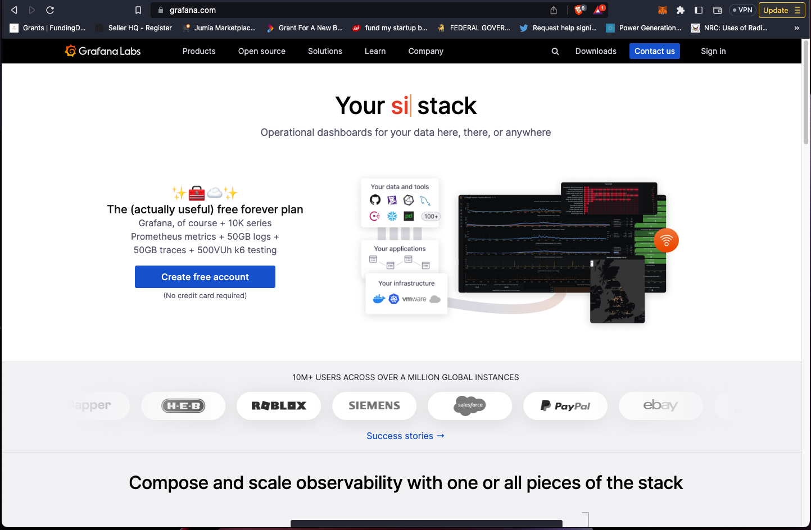

Sign in or create an account if you don't already have one. :

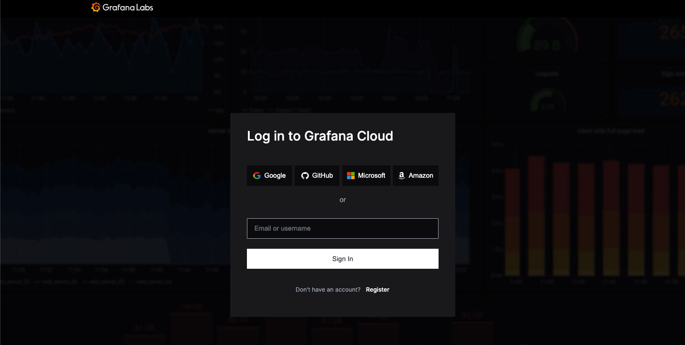

On your account page scroll down till you find Loki, then click on the "Details" button.
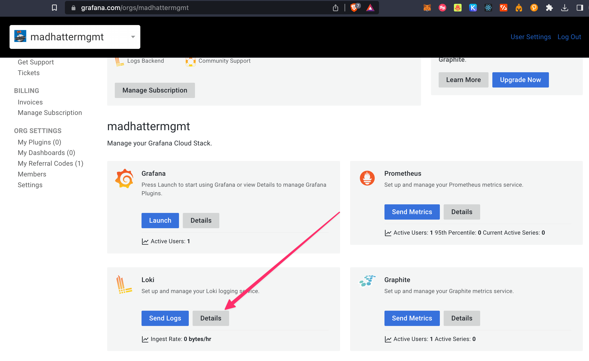

On the Loki details page, copy the "URL" and assign it to your env variable of `LOKI_HOST`, also copy the user value and assign it to `LOKI_USERNAME` env variable.
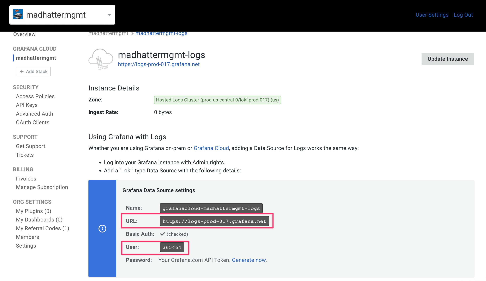

Lastly click "API keys" menu on the sidebar, then create a new API key or use one you already have. Assign the API key an editor role. Copy your API key and assign it to `LOKI_PASSWORD` in the .env file:
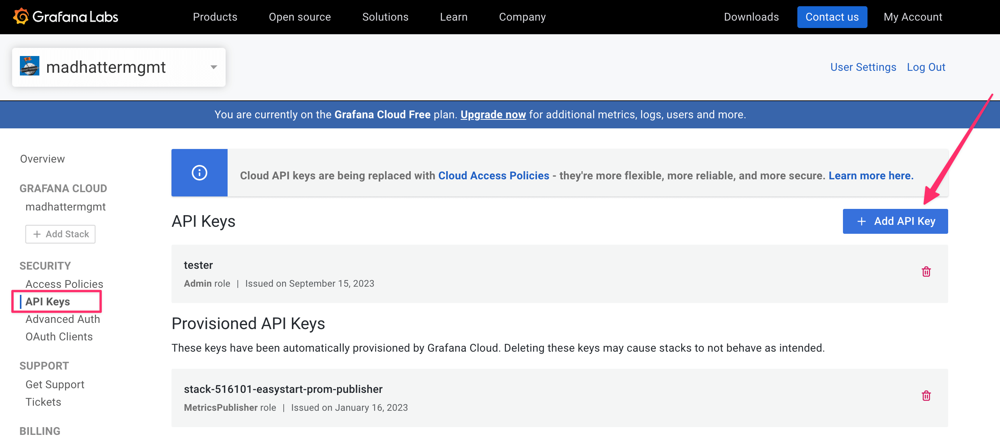

### Setup MongoDB

1. Visit MongoDB [website](https://account.mongodb.com/account/login) to create an account or login to your account:

2. create Project.:

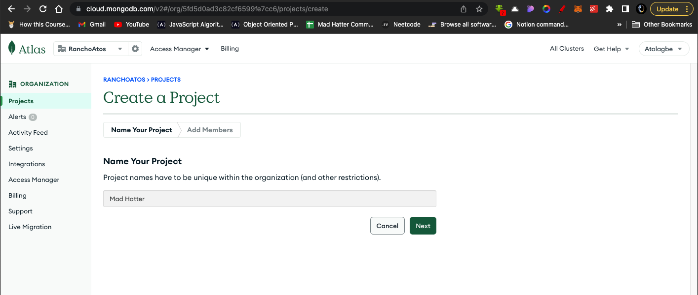

3. Create your project Database:


4. Setup your project details.: Username and password.
NB: copy and save your username and password somewhere as this will be included in the .env file as MONGODB_USERNAME and MONGODB_PASS

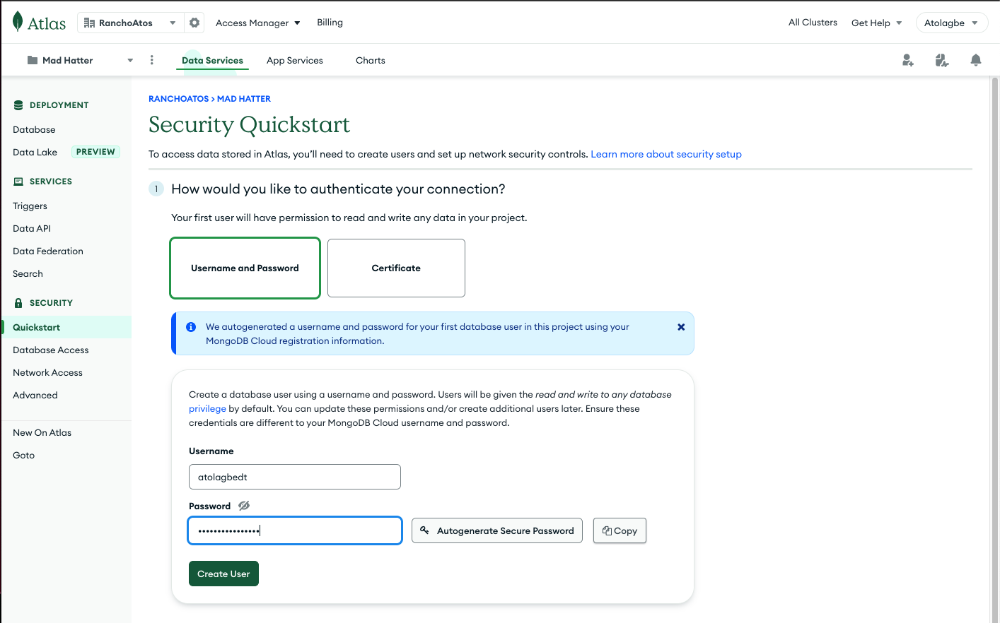

5. Add IP address:

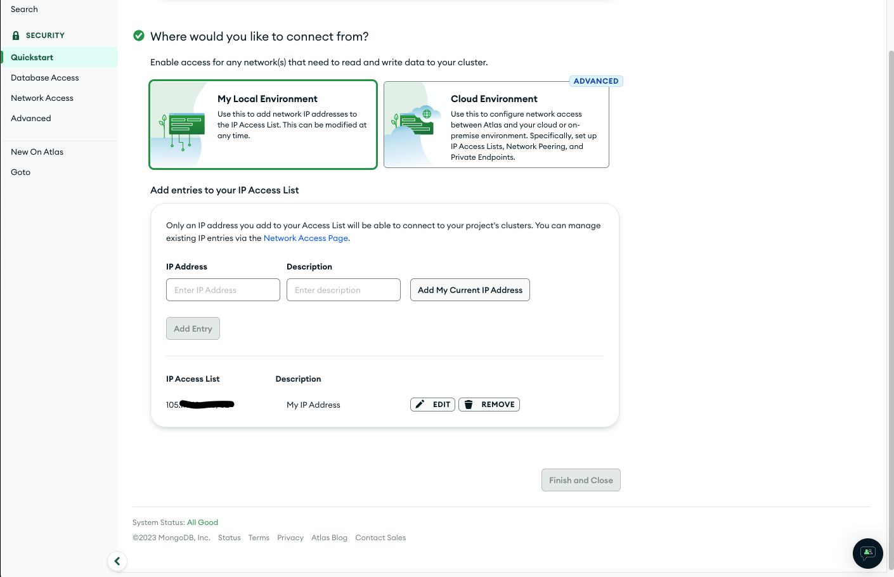

6. Complete setup. Click on the finish and close button:

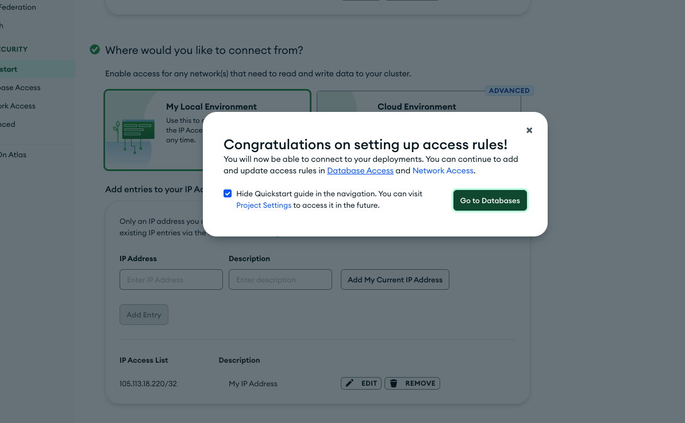

7. You should have a dashboard that looks likes this,
Click on the connect button to get the connection link:
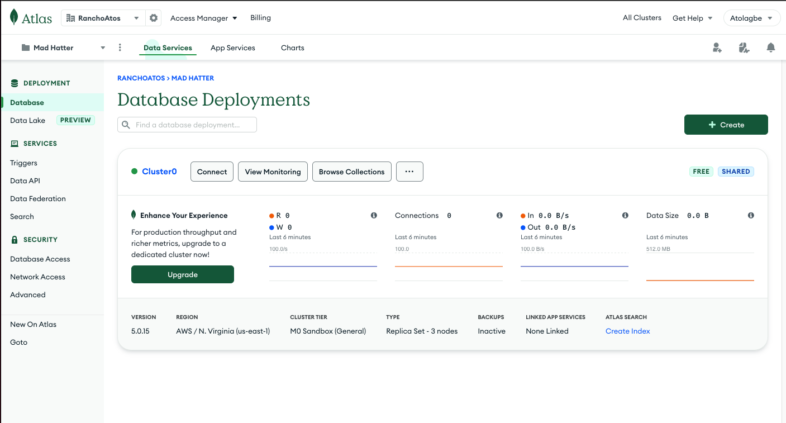

8. Click on Connect your application button to get your connections link (MONGODB_CLUSTER):
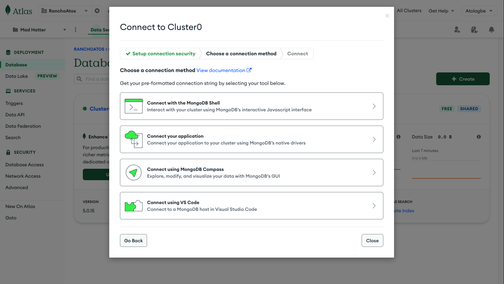

9. Copy your connection link.

Copy your MONGODB_PREFIX and MONGODB_CLUSTER in to your .env file from the connection link provided has as specified in the image below:
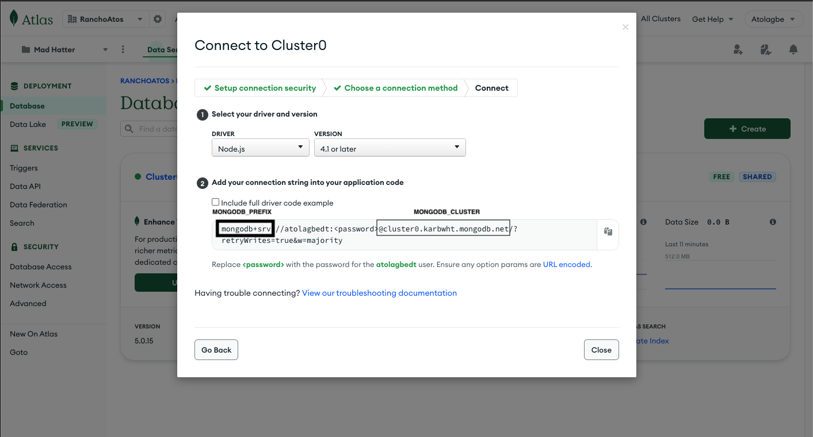

| Variable | Description|
| --- | --- |  
| DISCORD_BOT_APPLICATION_ID | Copy value of `APPLICATION ID` from Discord Developer Portal under your applications "General Information" tab. |
| DISCORD_BOT_PUBLIC_KEY | Copy value of `PUBLIC KEY` from Discord Developer Portal under your applications "General Information" tab. |
| DISCORD_BOT_TOKEN | Copy value of `TOKEN` from Discord Developer Portal under your applications "Bot" tab. |
| DISCORD_OWNER_ID | With developer mode enabled in Discord, right-click on your username in the server member list and click "Copy ID". |
| DISCORD_SERVER_ID | With developer mode enabled in Discord,, right click on the server name in the top-left corner and click "Copy ID". |
| NOTION_TOKEN | Only required if building or testing Notion commands. Can be generated from Notion integrations page. An admin will need to the integration to the QA Notion. |
| MONGODB_PREFIX | Omit if using Docker to build the application. |
| MONGODB_USERNAME | Omit if using Docker to build the application. |
| MONGODB_PASS | Omit if using Docker to build the application. |
| MONGODB_CLUSTER | Omit if using Docker to build the application. |
| LOKI_HOST | Put in your grafana loki endpoint `URL` here. |
| LOKI_USER_NAME | Put in your grafana loki `User` here. |
| LOKI_PASSWORD | Put in your copied grafana loki `API key` here. |

Example `.env` file (example uses random fake keys):

```
NODE_ENVIRONMENT=development
SENTRY_ENVIRONMENT
DISCORD_BOT_APPLICATION_ID=89840079503347765166
DISCORD_BOT_PUBLIC_KEY=0vn048hi4p4uh1j3qwkdw1zd9jrhkn4uumjbulrye9v7zgu64b
DISCORD_BOT_TOKEN=ZYW4fB62E9a7txQps3ijh1D4hGY4vQgq3KL0qh05F0NEjV6xO9
DISCORD_OWNER_ID=9939075523428180
DISCORD_SERVER_ID=851552281249972254
NOTION_TOKEN=secret_BFy9vBYebeZwR2a98UmZMgQINYzThqtrPcjamO
```

The Notion and Discord related variables in [.env.qa](../.env.qa) should be copied into `.env` if the bot is being deployed and tested in the Bankless Bot Garage Discord server.
